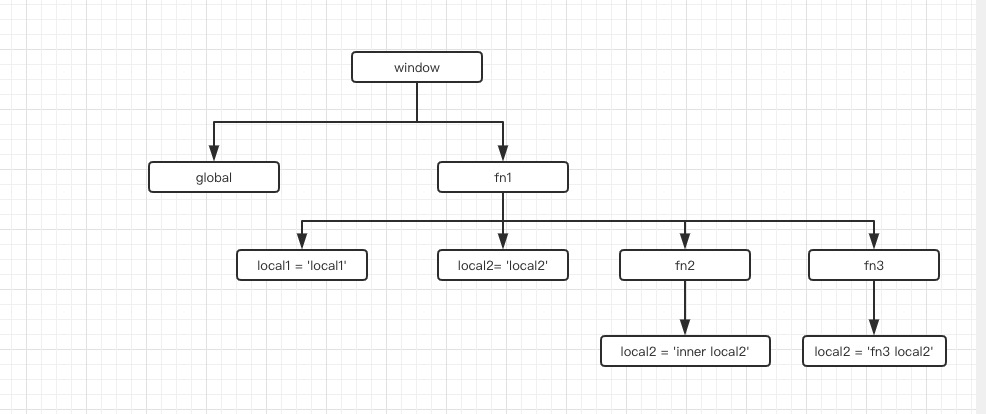
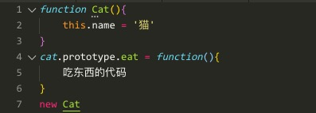
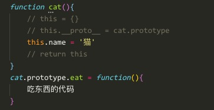

# JavaScript 函数

js 中的函数

## 定义

1. 匿名函数
2. 具名函数
3. 箭头函数

```
// 匿名函数
var fn = function(){
  return 1
}
fn2 = fn;

fn.name //fn
fn2.name //fn

// 具名函数
function fn3(){
  return 1
}      //fn3的作用域是全局

var fn5 = function fn4(){
  return 5
}
//如果将一个具名函数赋值给一个变量，那么这个具名函数的作用域就是该函数的花括号内
//例如fn4这个具名函数赋值给了fn5 那么fn4存在的作用域就是fn4的花括号内

// 箭头函数
var fn = () => {}
var fn2 = e => console.log(e)
var fn3 = (a, b) => {
  let c = a + b;
  return c;
}
```


## 词法作用域（也叫静态作用域）

```
var global = 1;
function fn1(param1){
  var local1 = 'local1'
  var local2 = 'local2'
  function fn2(param2){
    var local2 = 'inner local2'
    console.log(local1)
    console.log(local2)
  }
  function fn3(){
    var local2 = 'fn3 local2'
    fn2(local2)
  }
}
```


词法作用域： 变量的作用域是在定义的时候决定的，而不是执行的时候决定的，也就是说词法作用域取决于源码，通过静态分析就能确定，因此词法作用域也叫静态作用域。with 和 eval 除外，所以只能说 JS 的作用域机制非常接近词法作用域（ Lexical scope ）

值得一看的博客[javascript 的词法作用域](https://js8.in/2011/08/15/javascript的词法作用域/)

## call stack

stack - 栈 - 先进后出

[简单调用栈](http://latentflip.com/loupe/?code=ZnVuY3Rpb24gYSgpewogICAgY29uc29sZS5sb2coJ2ExJykKICAgIGIoKQogICAgY29uc29sZS5sb2coJ2EyJykKICByZXR1cm4gJ2EnICAKfQpmdW5jdGlvbiBiKCl7CiAgICBjb25zb2xlLmxvZygnYjEnKQogICAgYygpCiAgICBjb25zb2xlLmxvZygnYjInKQogICAgcmV0dXJuICdiJwp9CmZ1bmN0aW9uIGMoKXsKICAgIGNvbnNvbGUubG9nKCdjJykKICAgIHJldHVybiAnYycKfQphKCkKY29uc29sZS5sb2coJ2VuZCcp!!!)

[稍复杂的调用栈](http://latentflip.com/loupe/?code=ZnVuY3Rpb24gYSgpewogICAgY29uc29sZS5sb2coJ2ExJykKICAgIGIoKQogICAgY29uc29sZS5sb2coJ2EyJykKICByZXR1cm4gJ2EnICAKfQpmdW5jdGlvbiBiKCl7CiAgICBjb25zb2xlLmxvZygnYjEnKQogICAgYygpCiAgICBjb25zb2xlLmxvZygnYjInKQogICAgcmV0dXJuICdiJwp9CmZ1bmN0aW9uIGMoKXsKICAgIGNvbnNvbGUubG9nKCdjJykKICAgIHJldHVybiAnYycKfQphKCkKY29uc29sZS5sb2coJ2VuZCcp!!!)

[递归（斐波那契数列）](http://latentflip.com/loupe/?code=ZnVuY3Rpb24gZmFiKG4pewogICAgY29uc29sZS5sb2coJ3N0YXJ0IGNhbGMgZmFiICcrIG4pCiAgICBpZihuPj0zKXsKICAgICAgICByZXR1cm4gZmFiKG4tMSkgKyBmYWIobi0yKQogICAgfWVsc2V7CiAgICAgICAgcmV0dXJuIDEKICAgIH0KfQoKZmFiKDUp!!!PGJ1dHRvbj5DbGljayBtZSE8L2J1dHRvbj4%3D)

## this & argument

```
  function f(){
      console.log(this)
      console.log(arguments)
  }
  f.call() // window
  f.call({name:'男胖友'}) // {name: '男胖友'}, []
  f.call({name:'男胖友'},1) // {name: '男胖友'}, [1]
  f.call({name:'男胖友'},1,2) // {name: '男胖友'}, [1,2]
```

**注意**
call, apply, bind
call, apply 都是直接调用函数，只有参数上的区别，call 为逗号分割的值，apply 为数组
bind 则返回一个新的函数（并没有调用原来的函数），这个新的函数会 call 原来的函数，call 的参数由你指定

## 高阶函数/柯里化

- 柯里化:

  将 f( x, y )变成 f( 1, y ) 或者 f( x, 1 ) 【固定其余的参数，每次只有一个变量】

- 高阶函数:

  至少满足以下条件之一的就可以称为高阶函数

  1. 接受一个或者多个函数作为输入： forEach, sort, reduce, map 等
  2. 输出一个函数： lodash.curry
  3. 同时满足以上两个条件： function.prototype.bind

## 回调和构造函数

- 回调函数
  被当做参数的函数就是回调
  回调和异步没有关系

- 构造函数
  返回对象的函数就是构造函数
  一般首字母大写

## 几个知识

1. 对象和对象之间的关系
   不同的对象之间，可以通过 `__proto__` 来互相关联，`a.__proto__ = b;c.__proto__ = b;` 则  对象 a,c 都共同含有一个共有属性 b。 `__proto__` 就是共有属性的意思。
   通过共有属性，对象和对象之间就可以建立一种联系，减少重复的东西占用的空间
2. 函数和对象之间的关系
   关键字`this`
   `obj.sayName()` 等价于 `obj.sayName.call(obj)`
3. 关键字`new`
   如果你是用 new 和一个构造函数来创建一个对象，那么 new 的作用就是如下图注释掉的三行
   
   
