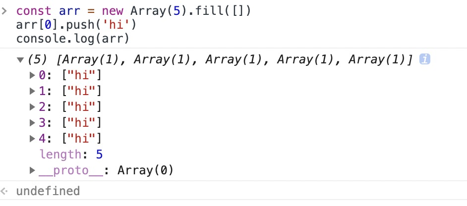

1.

```
<!Doctype html>
<script>
  const x = "sfds";
  console.log(typeof x);   //String
  console.log(typeof window.x);    //undefined
</script>
<script>
  console.log(typeof x);    //String
  console.log(typeof window.x);    //undefined
</script>
```

// es6 开始，let， const， class 声明的全局变量，不属于顶层对象的属性, 上下两个的作用域都是全局

2.

```
const arr = new Array(5).fill([])
arr[0].push('hi')
console.log(arr)
```


//如果填充的类型为对象，那么被赋值的是同一个内存地址的对象，而不是深拷贝对象。
[MDN: 当一个对象被传递给 fill 方法的时候, 填充数组的是这个对象的引用。](https://developer.mozilla.org/zh-CN/docs/Web/JavaScript/Reference/Global_Objects/Array/fill)

3.

```
var number = 10;
function fn() {
  console.log(this)
  console.log(this.number);
}
var obj = {
  number: 2,
  show: function(fn) {
    this.number = 3;
    fn();
    arguments[0]();
   },
};
obj.show(fn);
```

![argument[0]调用](奇怪的代码/argument[0]调用.jpg)
//词法作用域，第一个 number 是 window.number
//第二个是 fn.call(arguments),arguments 里没有 number，故为 undefined
